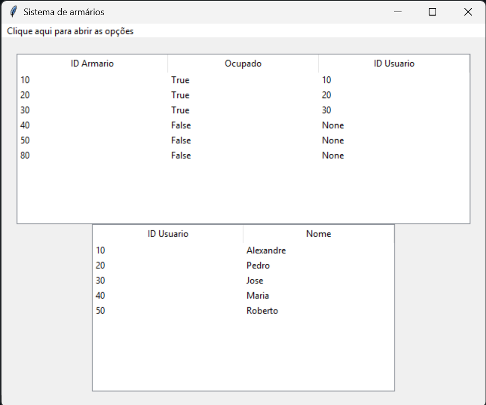

# 🔐 SmartLocker – Sistema de Lockers com Interface Tkinter

Projeto desenvolvido em Python com interface gráfica utilizando Tkinter. O **SmartLocker** simula um sistema de lockers inteligentes, como os usados nos correios dos EUA, onde um item pode ser deixado em um armário com senha e outra pessoa pode retirá-lo com segurança.

---

## 💡 Funcionalidades

- Cadastro de usuários
- Cadastro e gerenciamento de armários (lockers)
- Armazenamento de itens com senha
- Retirada de itens por terceiros com validação de senha
- Interface gráfica amigável feita em Tkinter

---

## 🎯 Objetivo

Este projeto foi criado como trabalho acadêmico para demonstrar habilidades com:
- Lógica de programação
- Estrutura de dados
- Criação de interfaces gráficas com Python
- Simulação de um sistema real de gerenciamento de armários inteligentes

---

## 🖥️ Interface


---

## ▶️ Como executar

1. Clone este repositório:
   ```bash
   git clone https://github.com/Xandi-avila/SmartLocker.git

2. Acesse a pasta do projeto:
     ```bash
   cd SmartLocker

3. Execute o projeto
   ```bash
   python main.py
